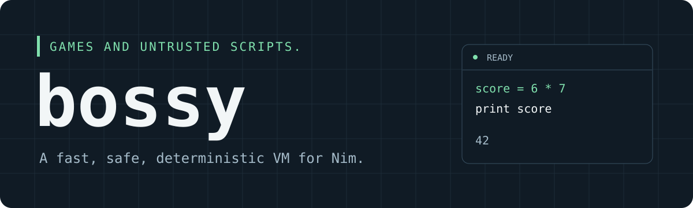

# Bossy - An embedded BASIC VM for games and untrusted scripts.


Depends on [Fixxy](https://github.com/treeform/fixxy) for fixed-point math.

## Introduction

Why choose to make a BASIC interpreter in 2026? The main reason is nostalgia. BASIC was the first language I learned, QBasic specifically, so I wanted to do it because it felt nostalgic and I thought it was cool.

The second reason is AI assistance: there are just so many BASIC examples. BASIC was one of the most popular languages from the 1980s through the mid-1990s. So many people, so many programs, and so many examples, including explanations of how to teach and learn programming in BASIC. There are examples of all kinds of weird things. I think all that material gives LLMs a lot to learn from. AI is surprisingly really, really good at writing BASIC, which is great because I want to use BASIC for scripts that will primarily be written by AIs.

The third reason is speed: BASIC ran on computers in the '80s that were running at something like 4 MHz. They were extremely slow. The language just doesn't give you that much. It is very, very simple and has very few features. That simplicity is part of what I wanted for a fast VM. The programs I want to run mainly use integers, simple functions, and `FOR` loops. There's no craziness going on.

Why use Bossy's BASIC VM instead of something like Lua or WASM?

Well, I just never really got into Lua. I know Lua is used for almost this exact purpose, but I feel like it is just a little bit too modern. I'm not a fan of its combined hash table/array data structure because I think it has a lot of weirdness. It feels weird that arrays start at 1. There are just those things. It feels quite complicated to me, and it has syntax that I'm not familiar with. I'm just not a fan of Lua.

Why not use WASM, then? Well, I think WASM is very heavyweight for what I want to do. I'd probably write the code in some other language, like C, C++, Rust, or Nim, and then compile it to WASM. I love Nim, but that still means another compilation step and a runtime library to embed. It might be good in some use cases, but I don't know. I just wanted something pretty simple to work with. I feel like it is just too much to embed a full WASM runtime with a shim for external functions.

The main reason why I don't want to use Lua or WASM is determinism. Unlike many BASIC implementations from the 1980s, this VM uses integers and fixed point instead of floating point so it can be deterministic between different architectures. A program running on Windows on x86 should run the exact same way on a Mac on ARM. This is very important for strategy games, where you want all the programs to run in lockstep. Starting from the same state, you only need to send the seed and player commands between the different VMs. The game also needs to provide the same inputs and deterministic host functions. Then the VMs produce the exact same results on all the different machines. This means you can share scripts, maybe AI scripts, simulation scripts, or whatever, between different players. When they execute those scripts, they get the exact same output, so everything stays in sync and the lockstep simulation can continue.

I also want to transfer code between different players. That code shouldn't be trusted. I want guardrails, such as a limited number of instructions. You can't just create an infinite loop in your program and lock up the other player. The VM counts the instructions and bails when the budget runs out. The harness running the VM has to decide what to do. It's the same with memory: you can't just allocate infinite memory in a loop and lock up the running process. The VM limits how much memory the script can use, and if it needs too much, it bails. Then the harness has to decide what to do with your unruly script.

> **AI disclaimer: This package and its documentation were prepared with AI assistance.**

## QBasic compatibility

Bossy keeps a lot of familiar QBasic syntax. Here is what carries over, what needs a little adjustment, and what belongs in the game hosting the VM.

🟢 **Same** means the listed syntax and usual behavior match. 🟠 **Different** means there are changes or host setup is needed. 🔴 **Not supported** means it is not built into the language. The numeric rules and resource limits below apply throughout.

| Feature | Compatibility | Bossy support and notes |
| --- | :---: | --- |
| Assignment | 🟢 Same | `x = 10`, optional `LET`, and case-insensitive variable names and keywords. |
| Comments and statement separators | 🟢 Same | Apostrophe and `REM` comments, with newlines or `:` between statements. |
| Conditions | 🟢 Same | Single-line `IF ... THEN ... ELSE` and block `IF` with `ELSEIF`, `ELSE`, and `END IF`. |
| Multiple-choice branches | 🟢 Same | `SELECT CASE`, value lists, `CASE ... TO ...` ranges, `CASE IS` comparisons, and `CASE ELSE`. |
| Counted loops | 🟢 Same | `FOR ... TO ... STEP ... NEXT`, positive and negative steps, nested loops, `NEXT inner, outer`, and `EXIT FOR`. |
| While loops | 🟢 Same | `WHILE ... WEND`. |
| Do loops | 🟢 Same | `DO ... LOOP`, `WHILE` or `UNTIL` at either end, and `EXIT DO`. |
| Labels and jumps | 🟢 Same | Named labels, line-number labels, `GOTO`, and `GOSUB ... RETURN` within the current procedure. |
| Comparisons and Boolean logic | 🟢 Same | `=`, `<>`, `<`, `<=`, `>`, `>=`, and `NOT`, `AND`, `OR`, `XOR`, `EQV`, `IMP`. Comparisons return -1 for true and 0 for false. |
| String expressions | 🟢 Same | `$` variables, quoted strings, doubled quotes inside literals, `+` concatenation, and case-sensitive comparisons. These work directly without host callbacks. |
| String length, slicing, and searching | 🟢 Same | `LEN`, `LEFT$`, `RIGHT$`, `MID$`, and `INSTR`, including one-based positions. |
| Character and text helpers | 🟢 Same | `CHR$`, `ASC`, `SPACE$`, `STRING$`, `UCASE$`, `LCASE$`, `LTRIM$`, and `RTRIM$` for byte strings and ASCII text. |
| Numbers and fixed point | 🟠 Different | Numeric variables start as int32 zero and can hold int32 or Q16.16 fixed-point values. Decimals use fixed point, including `E` and `D` exponents. The decimal range is -32768 to just under 32768, in steps of 1/65536. There are no floating-point types, numeric type suffixes, or `AS` declarations. |
| Arithmetic | 🟠 Different | `/` uses fixed point by default. `\` and `MOD` require exact integers and share precedence with `*` and `/`, unlike QBasic; parenthesize mixed expressions. Overflow wraps by default, and fixed-point rounding follows Fixxy. The `^` operator is not implemented. |
| Arrays | 🟠 Different | `DIM a(n)` and `DIM a$(n)` create one-dimensional global arrays indexed from 0 through `n`. Declarations must be at top level with a literal upper bound. No custom lower bounds, `OPTION BASE`, or `REDIM`. |
| Subroutines | 🟠 Different | `SUB ... END SUB`, `CALL`, `EXIT SUB`, and recursion are supported. Arguments are passed by value; other scalar variables are global. Calls use `name(args)` or `CALL name(args)`. Call depth is bounded. |
| Computed jumps | 🟠 Different | `ON ... GOTO` and `ON ... GOSUB` select an exact one-based integer match without QBasic's rounding. Unmatched values, including negative selectors, fall through to the next statement. |
| Output and numeric text | 🟠 Different | `PRINT` sends events to the host. Commas insert a space instead of a print zone; a trailing semicolon suppresses the newline. Fixed-point numbers use five decimal places, including through `STR$`. No `PRINT USING`. |
| String storage | 🟠 Different | Strings have configurable count, byte, and length limits. New strings consume storage until `reset`, so repeated concatenation can hit a limit. `TRIM$` is also available as a convenience extension. |
| Math, random numbers, and time | 🟠 Host setup | Numeric functions such as `ABS`, `SQR`, and `SIN`, plus randomness and time, must be supplied by the host. They are not built-ins. The host can expose deterministic math, seeded randomness, and simulation time. |
| Execution and errors | 🟠 Different | Instructions, work, memory, output, and call depth are bounded. Errors and exhausted budgets raise `BasicError` for the host to handle. `END` and `STOP` finish the script; there is no interactive debugger to resume it. |
| Files, operating system, and hardware | 🔴 Not supported | No `OPEN`, file I/O or file utilities, `SHELL`, or direct memory and hardware access such as `PEEK` and `POKE`. These are kept out so untrusted scripts cannot access the machine directly. |
| Graphics, sound, and interactive input | 🔴 Not supported | No QBasic screen or drawing stack (`SCREEN`, `PSET`, `LINE`, `CIRCLE`, etc.), sound commands, or console input such as `INPUT` and `INKEY$`. Bossy is for embedded scripts; the host game owns rendering, audio, and player input. |
| Other QBasic language features | 🔴 Not supported | Grouped omissions include value-returning `FUNCTION` and `DEF FN`, user-defined `TYPE` records, `DATA`/`READ`/`RESTORE`, `ON ERROR`/`RESUME`, multidimensional arrays, fixed-length strings, `MID$` assignment, and `VAL`. |

See [Bossy's language reference](docs/language.md) for the exact rules and [Microsoft's BASIC language reference](https://www.pcjs.org/documents/books/mspl13/basic/qblang/) for the original syntax and behavior.

## Install

Clone with an account that has repository access. Run these commands from your Nimby workspace directory:

```sh
git clone git@github.com:treeform/bossy.git
nimby install bossy/bossy.nimble
```

Installation also requires access to the private `treeform/fixxy` dependency. The optional benchmarks use `benchy`.

## Quick start

```nim
import bossy

block:
  let program = compile("answer = 6 * 7")
  var runtime = initRuntime(program)
  discard runtime.run
  echo runtime.getGlobal("answer") # Prints 42.
```

For BASIC `print` statements, pass a `PrintProc` to `run`. The default discards output while still charging its limits. [hello.nim](examples/hello.nim) shows how to write text, numbers, and newline events to the terminal.

## Embed in Nim

Register read-only host data with `addData` and native functions with `addFunction`. Host functions accept `openArray[int32]`, return `int32`, and have a declared work cost. Compile against that host, then bind a compatible host when creating each runtime.

```nim
import bossy

proc double(arguments: openArray[int32]): int32 =
  ## Doubles an int32 with wrapping arithmetic.
  arguments[0] *% 2

block:
  var host = initHost()
  discard host.addData("delta", 3)
  discard host.addFunction("double", 1, double, workUnits = 4)
  let program = compile("total = total + double(delta)", host)
  var runtime = initRuntime(program, host)
  discard runtime.run
  doAssert runtime.getGlobal("total") == 6

  runtime.setData("delta", 5)
  runtime.restart
  discard runtime.run
  doAssert runtime.getGlobal("total") == 16
```

`restart` replenishes execution budgets and preserves globals and arrays. `reset` also clears globals and arrays. Both retain the runtime's current host data and callback bindings. Changes to a `Host` affect future runtimes. Use `runtime.setData` to update an existing runtime.

Each runtime has its own numeric state and can share the compiled `Program`. Callbacks can still share captured Nim state. Create separate callback state and string pools when runtimes need to be isolated.

## Runtime and memory limits

Pass the same customized `Limits` to `compile` and `initRuntime`. Start with `defaultLimits()` and adjust source size, bytecode size, array capacity, globals, syntax depth, call depth, logical runtime memory, instruction count, work units, or output limits as needed. Invalid scripts and exceeded limits raise `BasicError`.

The defaults include:

| Resource | Default limit |
| --- | --- |
| Source size | 1 MiB |
| VM instructions per execution budget | 10,000,000 |
| VM work units per execution budget | 10,000,000 |
| Logical runtime memory | 64 MiB |
| Call depth | 64 frames |
| Print output per execution budget | 1 MiB and 100,000 events |
| Optional string pool | 64 KiB and 256 handles |
| Individual string length | 1,024 bytes |

Choose budgets that fit your game's update loop and number of active bots. `restart` and `reset` replenish the execution and output budgets, allowing the host to grant a fresh budget for each turn or decision. Work units charge operations according to their cost, including the declared cost of native callbacks. These are deterministic operation limits, not a wall-clock timeout.

The VM allocates its numeric runtime storage up front. Its memory limit accounts for logical storage such as globals, arrays, registers, and call frames. It excludes compiled programs, compiler allocations, allocator overhead, and native callback memory. Optional strings have separate `StringLimits`. Account for these separately when setting a total memory budget for many scripts.

Native callbacks are trusted Nim code and define the sandbox's capabilities. Validate their arguments and bound their time, allocations, and side effects. Their declared work cost does not interrupt a callback while it runs. Only register operations that downloaded scripts should be allowed to perform.

`run` executes until completion or an error. It does not yield after a budget is exhausted. On an error, state can contain partial changes. Use `restart` or `reset` before running again and choose how your application handles any host effects already performed.

## Strings

Create a `StringPool`, call `host.addStringFunctions(pool)`, compile with that host, then call `pool.bindProgram(program)` before running. See [strings.nim](examples/strings.nim) for a complete example.

`strNew("hello")` creates a string handle. A quoted argument itself is a compile-time literal ID, so functions that expect handles need `strNew`. Use `pool.putString` to inject host text and `pool.getString` to read a result. `putString` truncates text to the configured single-string length limit.

Reset the pool between runs as appropriate. Handles are pool indices and are reused after a reset. Never retain handles across a pool reset, including in globals or arrays preserved by `restart`. Reinitialize those values before reading them. String operations address bytes, and case conversion is ASCII.

## Documentation

- [BASIC language reference](docs/language.md).
- [Host callbacks and persistent execution](examples/hosts.nim).
- [Fixed-point values and numeric callbacks](examples/fixed.nim).
- [String pool example](examples/strings.nim).

Build the API reference locally:

```sh
nim doc --index:on --project --out:.gh-pages src/bossy.nim
```

Open `.gh-pages/bossy.html`. The Docs workflow also saves the generated API reference as a workflow artifact. Publishing with GitHub Pages is skipped while the repository is private.

## Development

From the repository root:

```sh
nim check src/bossy.nim
nim r tests/tests.nim
nim r -d:release tests/tests.nim
nim r -d:fixedChecks tests/tests.nim
nim r examples/hello.nim
nim r examples/hosts.nim
nim r examples/strings.nim
```

The tests cover language behavior, host bindings, independent runtimes, resource limits, malformed source, and string operations. CI runs on Linux, macOS, and Windows with Nim's default memory manager and thread settings.

Install the optional benchmark dependency from the workspace parent:

```sh
nimby install benchy
```

Then run from the repository root:

```sh
nim r -d:release tests/bench_bossy.nim
```
