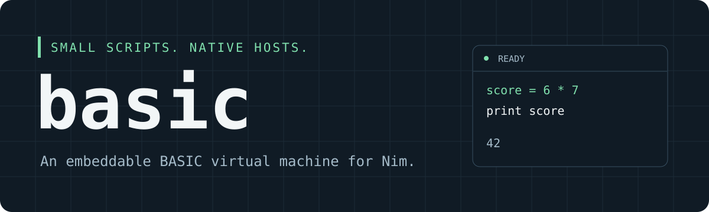

# basic - A small, embeddable BASIC compiler and virtual machine.

Compile a script once, create independent runtimes, and expose Nim data and
functions through a small host API. The library uses only Nim's standard
library and requires Nim 2.2.10 or newer.

## About

Basic is extracted from Polyworld's BASIC interpreter. It supports int32
arithmetic, arrays, structured control flow, subroutines, native callbacks,
bounded output, and optional strings represented by integer handles.

This repository is private while the standalone package is reviewed. It has
not been submitted to the Nimble package index. Polyworld retains its own copy.
See [extraction notes](docs/extraction.md) for the source revision.

> **AI disclaimer: This extraction, packaging, and documentation were prepared
> with AI assistance.**

## Install

Clone with an account that has repository access. Run these commands from
your Nimby workspace directory:

```sh
git clone git@github.com:treeform/basic.git
nimby install basic/basic.nimble
```

The library has no external runtime dependencies. The optional benchmarks
use `benchy`.

## Quick start

```nim
import basic

block:
  let program = compile("answer = 6 * 7")
  var runtime = initRuntime(program)
  discard runtime.run
  echo runtime.getGlobal("answer") # Prints 42.
```

For BASIC `print` statements, pass a `PrintProc` to `run`. The default discards
output while still charging its limits. [hello.nim](examples/hello.nim) shows
how to write text, numbers, and newline events to the terminal.

## Embed in Nim

Register read-only host data with `addData` and native functions with
`addFunction`. Host functions accept `openArray[int32]`, return `int32`, and
have a declared work cost. Compile against that host, then bind a compatible
host when creating each runtime.

```nim
import basic

proc double(arguments: openArray[int32]): int32 =
  ## Doubles an int32 with wrapping arithmetic.
  arguments[0] *% 2

block:
  var host = initHost()
  discard host.addData("delta", 3)
  discard host.addFunction("double", 1, double, workUnits = 4)
  let program = compile("total = total + double(delta)", host)
  var runtime = initRuntime(program, host)
  discard runtime.run
  doAssert runtime.getGlobal("total") == 6

  runtime.setData("delta", 5)
  runtime.restart
  discard runtime.run
  doAssert runtime.getGlobal("total") == 16
```

`restart` replenishes execution budgets and preserves globals and arrays.
`reset` also clears globals and arrays. Both retain the runtime's current host
data and callback bindings. Changes to a `Host` affect future runtimes. Use
`runtime.setData` to update an existing runtime.

Each runtime has its own numeric state and can share the compiled `Program`.
Callbacks can still share captured Nim state. Create separate callback state
and string pools when runtimes need to be isolated.

## Limits and errors

Pass the same customized `Limits` to `compile` and `initRuntime`. Start with
`defaultLimits()` and adjust source size, bytecode size, array capacity,
globals, syntax depth, call depth, logical runtime memory, instruction count,
work units, or output limits as needed. Invalid scripts and exceeded limits
raise `BasicError`.

The memory limit accounts for logical VM storage. It excludes compiled
programs, compiler allocations, allocator overhead, and native callback
memory. Optional strings have separate `StringLimits`. Native callbacks are
trusted Nim code and must bound their own time, allocations, and side effects.
Their declared work cost does not interrupt a callback while it runs.

`run` executes until completion or an error. It does not yield after a budget
is exhausted. On an error, state can contain partial changes. Use `restart`
or `reset` before running again and choose how your application handles any
host effects already performed.

## Strings

Create a `StringPool`, call `host.addStringFunctions(pool)`, compile with that
host, then call `pool.bindProgram(program)` before running. See
[strings.nim](examples/strings.nim) for a complete example.

`strNew("hello")` creates a string handle. A quoted argument itself is a
compile-time literal ID, so functions that expect handles need `strNew`.
Use `pool.putString` to inject host text and `pool.getString` to read a result.
`putString` truncates text to the configured single-string length limit.

Reset the pool between runs as appropriate. Handles are pool indices and are
reused after a reset. Never retain handles across a pool reset, including in
globals or arrays preserved by `restart`. Reinitialize those values before
reading them. String operations address bytes, and case conversion is ASCII.

## Documentation

- [BASIC language reference](docs/language.md).
- [Host callbacks and persistent execution](examples/hosts.nim).
- [String pool example](examples/strings.nim).

Build the API reference locally:

```sh
nim doc --index:on --project --out:.gh-pages src/basic.nim
```

Open `.gh-pages/basic.html`. The Docs workflow also saves the generated API
reference as a workflow artifact. Publishing with GitHub Pages is skipped
while the repository is private.

## Development

From the repository root:

```sh
nim check src/basic.nim
nim r tests/tests.nim
nim r -d:release tests/tests.nim
nim r examples/hello.nim
nim r examples/hosts.nim
nim r examples/strings.nim
```

The tests cover language behavior, host bindings, independent runtimes,
resource limits, malformed source, and string operations. CI runs on Linux,
macOS, and Windows with Nim's default memory manager and thread settings.

Install the optional benchmark dependency from the workspace parent:

```sh
nimby install benchy
```

Then run from the repository root:

```sh
nim r -d:release tests/bench_basic.nim
```
